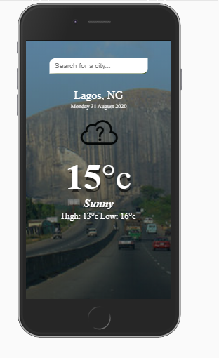

# My-Weather-Today
>  A weather app where users can get weather information in real-time.

## General info
The purpose of the project is to create a  a weather app where users can get weather information in real-time.. The project use the open weather API to make our API request

## Screenshots

## [live Demo](https://my-weather-today-28b5f.web.app/)

## How to run
*Download the entire folder on your laptop/computer.
*Open the index.html using any suitable browser such as Google Chrome, Firefox, etc.
*You can now view the webpage.
*Also, feel free to make changes in any editor such as VS Code and try them out.
Note: You might want to change the image path in the index.html file if in case it doesn't work.

## Technologies
* HTML5
* CSS3
* javascript
* vscode
* Git

## Features
* Responsive web desgn
* Fetches realtime weather results from open weather API
* The website meets Progressive Web App (PWA) criteria
* Implemented local storage
* Web Audit usin google lighthouse

## Contact me
Feel free to contact me on [linkedin](https://www.linkedin.com/in/monday-ofem/) and [twitter](https://twitter.com/MondayOfem)
